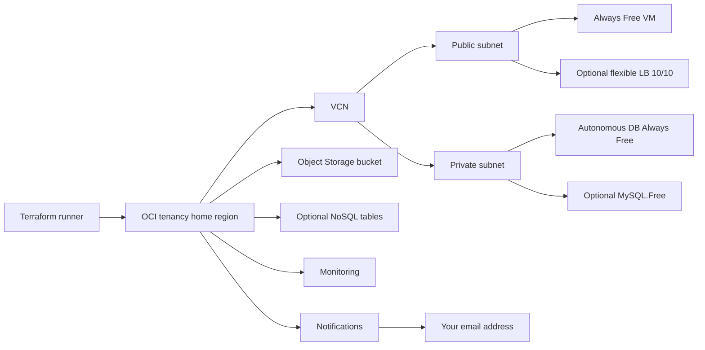
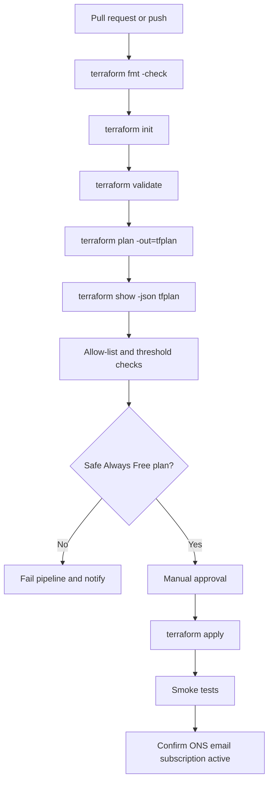

# Oracle Cloud Always Free Terraform Plan

## Executive summary

A strict **£0 / US$0 Oracle Cloud plan** is achievable only if you treat Oracle’s **Always Free** services as the entire design envelope and deliberately exclude broader “Free Tier trial” and any service with normal consumption pricing. Oracle distinguishes unlimited-duration **Always Free** services from the **30-day / US$300 trial credits**; if you do not upgrade after the trial period, the account becomes an **Always Free** account. For a user who does not want to spend even one cent, the safest operating rule is therefore: **do not upgrade to Pay As You Go, do not rely on trial credits, and allow Terraform to create only resources that are explicitly mapped to Always Free entitlements**. citeturn15search6turn8search0

The strongest Terraform pattern is a **single-region, single-compartment, allow-listed baseline**. Oracle documents that trial, free tier, and pay-as-you-go tenancies are limited to **one subscribed region**, and also notes that some specialised services are available only in selected regions. That makes **home-region choice** the most important design decision before you write any Terraform. For a lowest-risk baseline, choose a home region that supports the databases you need, then keep everything in that one region and one dedicated compartment. citeturn12view0

For Terraform itself, the OCI provider is mature and broad. Oracle’s current documentation shows the OCI provider as the standard Terraform provider for OCI resources, with the latest Registry release at **8.17.0** published in late May 2026. Oracle’s configuration guide documents API key authentication, Instance Principal, Resource Principal, Security Token, and OKE Workload Identity, even though the page text inconsistently says “four” methods while listing five. In practice, a no-spend plan should start with **API key auth locally** or **Instance Principal** when running inside OCI, and it should **pin the provider version** rather than float to `latest`. citeturn9search3turn9search0turn16view0turn17view0

My recommended reference stack for a strict zero-spend tenancy is: **one VCN**, **one public subnet**, **one private subnet**, **one small Always Free compute instance**, **one Object Storage bucket**, **one Always Free Autonomous Database**, and **OCI Notifications + Monitoring alarms** wired to your email address. Add **MySQL HeatWave Always Free** or **NoSQL Always Free** only if you actually need them. Keep **load balancing optional**, and if you enable it, pin it to the **lowest flexible bandwidth setting**. Exclude **Functions**, **API Gateway**, **OKE**, and any build service that can indirectly create billable compute. Oracle’s pricing page still lists regular pricing dimensions for Functions, and OCI DevOps build runners can consume billable compute. citeturn33view0turn15search9

The single biggest protection against accidental paid usage is not a dashboard after the fact. It is a combination of: **Terraform variable validation**, **preconditions**, **a plan JSON allow-list in CI**, **manual approval before apply**, **email notifications for operational thresholds**, and **a hard rule that no resources are created from the Console outside Terraform**. OCI Notifications supports email endpoints, and new subscriptions stay **Pending** until the email confirmation is accepted; your deployment checklist must verify that status before you trust the alerts. citeturn41view0turn40view1

## Always Free scope and region map

Oracle’s public regions page says commercial public cloud provides **41 cloud regions in 26 countries**, while Oracle’s OCI regions documentation currently enumerates a broader commercial-realm list of region identifiers, including newer realm groupings. For planning purposes, the operational rule is simpler than the counting discrepancy: **pick one home region and assume your Always Free stack will live there**. Oracle also states that some specialised services remain region-selective, so the right question is not “does OCI exist in this geography?” but “does my exact Always Free service exist in my home region?” citeturn14view0turn11view1turn12view0

The currently enumerated commercial public region identifiers in Oracle’s regions documentation are: `ap-sydney-1`, `ap-melbourne-1`, `sa-saopaulo-1`, `sa-vinhedo-1`, `ca-montreal-1`, `ca-toronto-1`, `sa-santiago-1`, `sa-valparaiso-1`, `sa-bogota-1`, `eu-paris-1`, `eu-marseille-1`, `eu-frankfurt-1`, `ap-hyderabad-1`, `ap-mumbai-1`, `ap-batam-1`, `il-jerusalem-1`, `eu-milan-1`, `eu-turin-1`, `ap-osaka-1`, `ap-tokyo-1`, `ap-kulai-2`, `mx-queretaro-1`, `mx-monterrey-1`, `af-casablanca-1`, `eu-amsterdam-1`, `me-riyadh-1`, `me-jeddah-1`, `eu-jovanovac-1`, `ap-singapore-1`, `ap-singapore-2`, `af-johannesburg-1`, `ap-seoul-1`, `ap-chuncheon-1`, `eu-madrid-1`, `eu-madrid-3`, `eu-stockholm-1`, `eu-zurich-1`, `me-abudhabi-1`, `me-dubai-1`, `uk-london-1`, `uk-cardiff-1`, `us-ashburn-1`, `us-chicago-1`, `us-phoenix-1`, and `us-sanjose-1`. Free tenancies can subscribe to **one region only**. citeturn11view1turn12view0

The table below separates **confirmed exact-limit services** from **region-specific caveats**. Where Oracle’s current text was explicit, I list exact limits. Where Oracle’s live page is broader but the exact quota was not cleanly extractable from the current text sources, I say so rather than guess.

| Service family | Confirmed Always Free limit | Region availability | Terraform OCI resource mapping | Strict default |
|---|---|---|---|---|
| Compute VM | Oracle’s Always Free programme includes **Arm and AMD VMs**; Oracle’s public Free page summarises these as **AMD and Arm Compute VMs**. In practice the long-standing envelope is the Always Free Arm pool and the E2 micro shape, and this report treats only **`VM.Standard.A1.Flex`** and **`VM.Standard.E2.1.Micro`** as allowed. citeturn14view0turn29view2 | Any subscribed commercial home region with capacity; capacity can still be unavailable. citeturn12view0turn32view0 | `oci_core_instance` citeturn29view2 | **Enabled** |
| Block storage | **200 GB total** on Oracle’s Free page summary. citeturn14view0 | Same region and same availability domain as attached instance. citeturn34view1turn35view0 | `oci_core_volume`, `oci_core_volume_attachment`, optional `oci_core_boot_volume_backup` citeturn34view1turn35view0turn35view1 | **Enabled** |
| Object Storage | **10 GB** Object Storage on Oracle’s Free page summary. citeturn14view0 | Regional service; bucket stays in the selected home region. citeturn12view0turn35view2 | `oci_objectstorage_bucket`, `oci_objectstorage_object` citeturn35view2turn34view0 | **Enabled** |
| Outbound data transfer | **10 TB/month** outbound on Oracle’s Free page summary. citeturn14view0 | Regional usage characteristic, not a Terraform resource. | No direct resource; govern through architecture and alarms. | **Enabled, but guard carefully** |
| Load Balancer | Oracle’s Always Free resources page includes load balancing; the safest Terraform posture is **Flexible shape pinned to 10/10 Mbps**, which is the provider’s minimum flexible bandwidth. citeturn1view0turn33view0 | Regional; use only in the home region. | `oci_load_balancer_load_balancer`, plus backend set and listener resources. citeturn33view0turn20search13turn25search6 | **Optional** |
| Network Load Balancer | Oracle’s Always Free resources page includes network load balancing; keep the deployment minimal. citeturn1view0turn32view3 | Regional; use only in the home region. | `oci_network_load_balancer_network_load_balancer`, listener, backend. citeturn32view3turn25search12turn25search9 | **Optional** |
| Autonomous Database | **Two Always Free Autonomous Databases, 20 GB each** on Oracle’s Free page summary; provider flag is `is_free_tier = true`. Oracle’s provider docs say free ADB is fixed at **1 CPU** and cannot be scaled. citeturn14view0turn30view2 | Available in **most** home regions; APEX 26ai capabilities specifically require home region in **Ashburn, Phoenix, Frankfurt, or London**. citeturn13search10 | `oci_database_autonomous_database` citeturn31view0turn30view2 | **Enabled** |
| MySQL HeatWave | **One Always Free DB system** in the **home region** of a **commercial-realm** tenancy; **50 GB** data/log storage plus **50 GB** extra backup storage. Oracle’s creation doc fixes the shape to **`MySQL.Free`**, the HeatWave shape to **`HeatWave.Free`**, backup retention to **1 day**, and disables HA. citeturn7search11turn15search3turn37view0 | **Home region only** for commercial realm tenancies. citeturn7search11turn37view0 | `oci_mysql_mysql_db_system` citeturn38view0turn39view0 | **Optional** |
| NoSQL Database | **Up to three Always Free tables**, **25 GB storage per table**, **50 read units** and **50 write units** per table. citeturn7search13turn7search17 | **Phoenix only** for the Always Free option. citeturn7search5turn7search13 | `oci_nosql_table` citeturn40view0 | **Optional, Phoenix only** |
| Monitoring | Oracle’s Always Free page includes Monitoring; the reviewed Oracle text confirms Monitoring alarms are supported in Terraform, and Oracle documents Monitoring alarm creation and limits. citeturn40view1turn1view0 | Regional. | `oci_monitoring_alarm` citeturn40view1 | **Enabled** |
| Notifications | Oracle’s Always Free page includes Notifications; Terraform supports topics and subscriptions, including **EMAIL**. citeturn28view2turn41view0turn1view0 | Regional. | `oci_ons_notification_topic`, `oci_ons_subscription` citeturn28view2turn41view0 | **Enabled** |
| APEX service | Oracle documents Always Free APEX service and says it is available in **most** OCI data regions, but createable only in the **home region**; the exact tenancy count was not cleanly extractable from the text snapshot used here. citeturn13search10 | Home region only; 26ai-specific free availability noted for Ashburn, Phoenix, Frankfurt, London. citeturn13search10 | Operationally map to `oci_database_autonomous_database` with `db_workload = "APEX"`. citeturn30view3 | **Optional** |

Two region-specific exceptions matter disproportionately. **MySQL HeatWave Always Free** is tied to the **home region** in the commercial realm, and the documented create flow fixes the free shape and storage defaults. **NoSQL Always Free** is explicitly documented as **Phoenix-only**. If you need either service, choose your Oracle home region accordingly *before* you design the tenancy around Terraform. citeturn7search11turn37view0turn7search5turn7search13

For a strict zero-spend baseline, I would **exclude Oracle Functions** even though the original prompt mentioned it. Oracle’s pricing page still shows chargeable Functions dimensions, so Functions should not be treated as presumed safe unless Oracle explicitly adds it to the Always Free inventory you verify on the live page at deployment time. The same conservative rule applies to services such as API Gateway or any CI feature that can spin up compute indirectly. citeturn15search9



## Terraform OCI provider mapping

Oracle’s OCI provider documentation describes the provider as the standard way to manage OCI with Terraform, including use from local Terraform and OCI Resource Manager. The Registry lists the current OCI provider as **`oracle/oci`**, latest version **8.17.0**, and Oracle’s Resource Manager documentation says Resource Manager supports the latest OCI provider for supported Terraform versions. For a controlled, low-drift baseline, pin to **`~> 8.17.0`** instead of leaving the version unconstrained. citeturn25search20turn9search3turn9search0turn17view0

Oracle’s provider configuration page is unusually important for a no-spend design because authentication choice directly affects operational risk. API key authentication requires `tenancy_ocid`, `user_ocid`, `private_key` or `private_key_path`, `fingerprint`, and `region`. Oracle also documents Instance Principal, Resource Principal, Security Token, and OKE Workload Identity. For a personal Always Free tenancy, the safest default is **API key auth for local development** and then **Instance Principal** if you later run Terraform on an OCI compute instance; that removes the need for long-lived keys in automation. Oracle also documents that environment variables override config file profiles, which is useful for CI isolation. citeturn16view0

A dedicated compartment is strongly recommended even though Oracle notes that the tenancy OCID is also the root compartment OCID and can be used where any compartment OCID is required. In a zero-spend setup, the control objective is *containment*, not convenience. Put all Always Free resources in one compartment such as `always-free-lab`, deny ad hoc console creation for everyday users, and apply the same freeform tags everywhere so that cost analysis, cleanup, and drift review all operate against a single blast radius. citeturn16view0turn28view0turn28view2

The main provider-to-service mapping is straightforward:

| Always Free workload | Primary Terraform resources | Key configuration note | Source |
|---|---|---|---|
| VCN and subnets | `oci_core_vcn`, `oci_core_subnet` | VCN auto-creates default route table, security list, and DHCP options; subnet CIDR cannot be resized later. citeturn29view0turn32view2 | citeturn29view0turn32view2 |
| Compute VM | `oci_core_instance` | Restrict shape to `VM.Standard.A1.Flex` or `VM.Standard.E2.1.Micro`; use `shape_config` only where valid. citeturn32view0turn32view1 | citeturn29view2turn32view0turn32view1 |
| Block volume | `oci_core_volume`, `oci_core_volume_attachment` | Volume and instance must be in the same availability domain. citeturn34view1turn35view0 | citeturn34view1turn35view0 |
| Object storage | `oci_objectstorage_bucket`, `oci_objectstorage_object` | Default bucket access should stay `NoPublicAccess`; object upload can come from inline content or local source. citeturn35view2turn34view0 | citeturn35view2turn34view0 |
| Autonomous DB | `oci_database_autonomous_database` | Set `is_free_tier = true`; free ADB cannot scale CPU/memory. citeturn30view2 | citeturn31view0turn30view2 |
| MySQL HeatWave | `oci_mysql_mysql_db_system` | Set `shape_name = "MySQL.Free"` and `is_highly_available = false`. citeturn37view0turn39view1 | citeturn38view0turn39view0turn39view1 |
| NoSQL | `oci_nosql_table` | Pin table limits to the Always Free envelope; only relevant in Phoenix. citeturn40view0turn7search5 | citeturn40view0turn7search5 |
| LB / NLB | `oci_load_balancer_load_balancer`, `oci_network_load_balancer_network_load_balancer` | Keep LB flexible shape at 10/10 Mbps minimum; avoid scaling bandwidth. citeturn33view0turn32view3 | citeturn33view0turn32view3 |
| Email alerts | `oci_ons_notification_topic`, `oci_ons_subscription`, `oci_monitoring_alarm` | Email subscription stays pending until confirmed. citeturn41view0turn40view1 | citeturn28view2turn41view0turn40view1 |

A minimal provider and root-variable block that matches Oracle’s documented configuration model looks like this:

```hcl
terraform {
  required_version = ">= 1.6.0"

  required_providers {
    oci = {
      source  = "oracle/oci"
      version = "~> 8.17.0"
    }
  }
}

provider "oci" {
  tenancy_ocid        = var.tenancy_ocid
  user_ocid           = var.user_ocid
  fingerprint         = var.fingerprint
  private_key_path    = var.private_key_path
  region              = var.region
  config_file_profile = var.config_file_profile
}

variable "tenancy_ocid"        { type = string }
variable "user_ocid"           { type = string }
variable "fingerprint"         { type = string }
variable "private_key_path"    { type = string }
variable "config_file_profile" { type = string, default = "DEFAULT" }
variable "region"              { type = string }
variable "compartment_id"      { type = string }
```

If you later move Terraform execution inside OCI, Oracle documents the Instance Principal form as:

```hcl
provider "oci" {
  auth   = "InstancePrincipal"
  region = var.region
}
```

Those forms follow Oracle’s current provider guide and keep the authentication contract inside Oracle-documented behaviour. citeturn16view0turn9search3

## Reference module patterns and snippets

The most robust pattern is a **root module that composes small, opinionated child modules**, each with a hard-coded Always Free default and strong input validation. The idea is not “maximum flexibility”; it is “minimum opportunity to ask Terraform to create anything paid”. Oracle’s own resource docs show the required shapes, IDs, arguments, and update semantics, which makes Terraform validation a practical first line of defence. citeturn29view0turn29view2turn31view0turn38view0

A simple root composition looks like this:

```hcl
module "network" {
  source         = "./modules/network"
  compartment_id = var.compartment_id
  name_prefix    = "af"
}

module "compute" {
  source              = "./modules/compute"
  compartment_id      = var.compartment_id
  availability_domain = var.availability_domain
  subnet_id           = module.network.public_subnet_id
  ssh_public_key      = var.ssh_public_key
}

module "bucket" {
  source         = "./modules/object_storage"
  compartment_id = var.compartment_id
  namespace      = var.object_storage_namespace
  bucket_name    = "af-${var.region}-assets"
}

module "adb" {
  source         = "./modules/autonomous_db"
  compartment_id = var.compartment_id
  display_name   = "af-adb"
  db_name        = "AFADB"
  admin_password = var.adb_admin_password
}

module "alerts" {
  source              = "./modules/observability"
  compartment_id      = var.compartment_id
  notification_email  = var.notification_email
  metric_namespace    = var.metric_namespace
  mql_query           = var.mql_query
}

output "public_ip"          { value = module.compute.public_ip }
output "bucket_name"        { value = module.bucket.bucket_name }
output "autonomous_db_id"   { value = module.adb.autonomous_database_id }
output "notification_topic" { value = module.alerts.topic_id }
```

A **network** module can stay very small. Oracle documents `oci_core_vcn` and `oci_core_subnet` as the foundational network primitives, and it explicitly notes that the VCN auto-creates default route, security list, and DHCP resources while the subnet size cannot be changed after creation. That argues for conservative CIDRs and a shallow topology. citeturn29view0turn32view2

```hcl
variable "compartment_id" { type = string }
variable "name_prefix"    { type = string, default = "af" }
variable "vcn_cidr"       { type = string, default = "10.10.0.0/16" }
variable "public_cidr"    { type = string, default = "10.10.0.0/24" }
variable "private_cidr"   { type = string, default = "10.10.1.0/24" }

resource "oci_core_vcn" "this" {
  compartment_id = var.compartment_id
  cidr_blocks    = [var.vcn_cidr]
  display_name   = "${var.name_prefix}-vcn"
  dns_label      = "afvcn"
  freeform_tags  = { cost_class = "always-free", managed_by = "terraform" }
}

resource "oci_core_subnet" "public" {
  compartment_id             = var.compartment_id
  vcn_id                     = oci_core_vcn.this.id
  cidr_block                 = var.public_cidr
  display_name               = "${var.name_prefix}-public"
  dns_label                  = "pub"
  prohibit_public_ip_on_vnic = false
  freeform_tags              = { cost_class = "always-free", managed_by = "terraform" }
}

resource "oci_core_subnet" "private" {
  compartment_id             = var.compartment_id
  vcn_id                     = oci_core_vcn.this.id
  cidr_block                 = var.private_cidr
  display_name               = "${var.name_prefix}-private"
  dns_label                  = "priv"
  prohibit_public_ip_on_vnic = true
  freeform_tags              = { cost_class = "always-free", managed_by = "terraform" }
}

output "vcn_id"            { value = oci_core_vcn.this.id }
output "public_subnet_id"  { value = oci_core_subnet.public.id }
output "private_subnet_id" { value = oci_core_subnet.private.id }
```

A **compute** module should be aggressively opinionated. Oracle’s instance resource supports many shapes and many optional platform settings, but a zero-spend baseline should accept only the Always Free shapes and should default to the smallest useful Arm configuration. Use metadata for SSH keys and Cloud-Init, because Oracle explicitly documents `ssh_authorized_keys` and `user_data` in instance metadata. citeturn32view0turn32view1

```hcl
variable "compartment_id"      { type = string }
variable "availability_domain" { type = string }
variable "subnet_id"           { type = string }
variable "image_id"            { type = string }
variable "ssh_public_key"      { type = string }

variable "instance_shape" {
  type    = string
  default = "VM.Standard.A1.Flex"
  validation {
    condition     = contains(["VM.Standard.A1.Flex", "VM.Standard.E2.1.Micro"], var.instance_shape)
    error_message = "Only Always Free shapes are allowed."
  }
}

variable "instance_ocpus" {
  type    = number
  default = 1
  validation {
    condition     = var.instance_ocpus <= 4
    error_message = "Keep total Arm OCPUs within the Always Free envelope."
  }
}

variable "instance_memory_gbs" {
  type    = number
  default = 6
  validation {
    condition     = var.instance_memory_gbs <= 24
    error_message = "Keep total Arm memory within the Always Free envelope."
  }
}

resource "oci_core_instance" "this" {
  availability_domain = var.availability_domain
  compartment_id      = var.compartment_id
  shape               = var.instance_shape
  display_name        = "af-vm"

  create_vnic_details {
    subnet_id        = var.subnet_id
    assign_public_ip = true
  }

  metadata = {
    ssh_authorized_keys = var.ssh_public_key
    user_data           = base64encode("#cloud-config\npackage_update: true\n")
  }

  dynamic "shape_config" {
    for_each = var.instance_shape == "VM.Standard.A1.Flex" ? [1] : []
    content {
      ocpus         = var.instance_ocpus
      memory_in_gbs = var.instance_memory_gbs
    }
  }

  source_details {
    source_type = "image"
    source_id   = var.image_id
  }

  freeform_tags = { cost_class = "always-free", managed_by = "terraform" }
}

output "instance_id" { value = oci_core_instance.this.id }
output "public_ip"   { value = oci_core_instance.this.public_ip }
```

A **block storage** module should not be enabled by default. Oracle’s block volume resource minimum is much larger than people often assume, and the Always Free storage pool is shared. That means every attached block volume reduces the storage available for boot volumes and other storage-backed services. Use it only when persistence is necessary. citeturn34view1turn35view0

```hcl
variable "enabled"            { type = bool, default = false }
variable "compartment_id"     { type = string }
variable "availability_domain"{ type = string }
variable "instance_id"        { type = string }
variable "size_in_gbs" {
  type    = number
  default = 50
  validation {
    condition     = var.size_in_gbs >= 50 && var.size_in_gbs <= 200
    error_message = "Use a conservative block volume size inside the 200 GB pool."
  }
}

resource "oci_core_volume" "this" {
  count               = var.enabled ? 1 : 0
  compartment_id      = var.compartment_id
  availability_domain = var.availability_domain
  size_in_gbs         = var.size_in_gbs
  display_name        = "af-data"
  freeform_tags       = { cost_class = "always-free", managed_by = "terraform" }
}

resource "oci_core_volume_attachment" "this" {
  count           = var.enabled ? 1 : 0
  attachment_type = "paravirtualized"
  instance_id     = var.instance_id
  volume_id       = oci_core_volume.this[0].id
}
```

An **Object Storage** module is uncomplicated and should default to private access. Oracle documents `NoPublicAccess` as the safe default for buckets. Unless you have a specific static-file use case, keep object events disabled and keep the bucket private. citeturn35view2turn34view0

```hcl
variable "compartment_id" { type = string }
variable "namespace"      { type = string }
variable "bucket_name"    { type = string }

resource "oci_objectstorage_bucket" "this" {
  compartment_id        = var.compartment_id
  namespace             = var.namespace
  name                  = var.bucket_name
  access_type           = "NoPublicAccess"
  storage_tier          = "Standard"
  object_events_enabled = false
  freeform_tags         = { cost_class = "always-free", managed_by = "terraform" }
}

output "bucket_name" { value = oci_objectstorage_bucket.this.name }
```

An **Autonomous Database** module is the cleanest database option for a strict baseline because the OCI provider gives you a direct Always Free switch. Oracle documents `is_free_tier` on `oci_database_autonomous_database`, and the workload can be `OLTP`, `AJD`, or `APEX` among others. For a first deployment, default to `OLTP`, keep public access off unless you genuinely need it, and never set scaling options that imply a non-free configuration. citeturn31view0turn30view2turn30view3

```hcl
variable "compartment_id" { type = string }
variable "display_name"   { type = string, default = "af-adb" }
variable "db_name"        { type = string, default = "AFADB" }
variable "admin_password" { type = string, sensitive = true }
variable "db_workload" {
  type    = string
  default = "OLTP"
  validation {
    condition     = contains(["OLTP", "AJD", "APEX"], var.db_workload)
    error_message = "Use an Always Free-compatible ADB workload."
  }
}

resource "oci_database_autonomous_database" "this" {
  compartment_id = var.compartment_id
  display_name   = var.display_name
  db_name        = var.db_name
  admin_password = var.admin_password
  db_workload    = var.db_workload
  is_free_tier   = true
  freeform_tags  = { cost_class = "always-free", managed_by = "terraform" }
}

output "autonomous_database_id" { value = oci_database_autonomous_database.this.id }
```

If you need **MySQL HeatWave Always Free**, use a separate optional module and hard-code the free shape. Oracle’s free MySQL create flow explicitly fixes the Always Free DB system to **`MySQL.Free`**, **50 GB storage**, **1-day retention**, **PITR disabled**, and no HA. That makes it ideal for Terraform validation. citeturn37view0turn38view0turn39view1turn39view3

```hcl
variable "enabled"            { type = bool, default = false }
variable "compartment_id"     { type = string }
variable "availability_domain"{ type = string }
variable "subnet_id"          { type = string }
variable "admin_username"     { type = string, default = "adminuser" }
variable "admin_password"     { type = string, sensitive = true }
variable "display_name"       { type = string, default = "af-mysql" }

resource "oci_mysql_mysql_db_system" "this" {
  count               = var.enabled ? 1 : 0
  availability_domain = var.availability_domain
  compartment_id      = var.compartment_id
  shape_name          = "MySQL.Free"
  subnet_id           = var.subnet_id
  admin_username      = var.admin_username
  admin_password      = var.admin_password
  display_name        = var.display_name
  is_highly_available = false
  data_storage_size_in_gb = 50

  backup_policy {
    is_enabled        = true
    retention_in_days = 1
    pitr_policy {
      is_enabled = false
    }
  }

  freeform_tags = { cost_class = "always-free", managed_by = "terraform" }
}
```

A **NoSQL** module is elegant but only if your home region is Phoenix. Oracle documents the free table limits clearly enough that Terraform can encode them directly. This is a good example of using Terraform not only to provision OCI resources, but also to freeze service limits in code so they cannot drift upward accidentally. citeturn40view0turn7search5turn7search13

```hcl
variable "enabled"        { type = bool, default = false }
variable "compartment_id" { type = string }
variable "table_name"     { type = string, default = "AF_TABLE" }

resource "oci_nosql_table" "this" {
  count          = var.enabled ? 1 : 0
  compartment_id = var.compartment_id
  name           = var.table_name
  ddl_statement  = "CREATE TABLE ${var.table_name}(id STRING, payload STRING, PRIMARY KEY(id))"
  is_auto_reclaimable = true

  table_limits {
    max_read_units    = 50
    max_write_units   = 50
    max_storage_in_gbs = 25
  }

  freeform_tags = { cost_class = "always-free", managed_by = "terraform" }
}
```

Finally, an **alerts** module should always be present. Oracle documents the Notifications topic and subscription resources, supports **EMAIL** protocol, and documents Terraform-based Monitoring alarms that send to notification topics. The only operational trap is that a fresh email subscription is **Pending** until the recipient confirms it. citeturn28view2turn41view0turn40view1

```hcl
variable "compartment_id"     { type = string }
variable "notification_email" { type = string }
variable "metric_namespace"   { type = string }
variable "mql_query"          { type = string }

resource "oci_ons_notification_topic" "alerts" {
  compartment_id = var.compartment_id
  name           = "always-free-alerts"
  description    = "Notifications for Always Free guardrails"
  freeform_tags  = { cost_class = "always-free", managed_by = "terraform" }
}

resource "oci_ons_subscription" "email" {
  compartment_id = var.compartment_id
  topic_id       = oci_ons_notification_topic.alerts.id
  protocol       = "EMAIL"
  endpoint       = var.notification_email
  freeform_tags  = { cost_class = "always-free", managed_by = "terraform" }
}

resource "oci_monitoring_alarm" "threshold" {
  compartment_id      = var.compartment_id
  destinations        = [oci_ons_notification_topic.alerts.id]
  display_name        = "always-free-threshold"
  is_enabled          = true
  metric_compartment_id = var.compartment_id
  namespace           = var.metric_namespace
  query               = var.mql_query
  severity            = "WARNING"
  pending_duration    = "PT5M"
  body                = "Always Free threshold crossed. Review immediately."
  freeform_tags       = { cost_class = "always-free", managed_by = "terraform" }
}
```

## Constraints and failure modes

The main architectural constraint is **region locking**. Oracle documents that free tenancies subscribe to one region, while specialised services can be selective. That creates asymmetric failure modes: a plan may validate syntactically, but still be impossible because the region does not support the service, because the Always Free overlay exists only in the home region, or because the service is Phoenix-only in the free form. This is why the correct sequence is **home-region decision first, Terraform second**. citeturn12view0turn7search11turn7search5turn13search10

The second constraint is **capacity**. Oracle’s compute instance documentation points you to the capacity report operation to check whether shape capacity is available, and Oracle’s MySQL Always Free creation flow explicitly mentions `OutOfHostCapacity` as a possible work request error. In practice, this means that Arm capacity and MySQL Free capacity can fail even when the service is theoretically supported in the region. The mitigation is not to oversubscribe your design: keep an **E2 micro fallback** for compute, and do not make MySQL Free your only persistence option unless your chosen home region is known to be stable for it. citeturn32view0turn37view0

Several OCI resources also have **replacement semantics** that can surprise Terraform users. Oracle documents that the VCN’s DNS label is immutable, that subnet size cannot be changed after creation, and that some resource properties force recreation rather than update. For load balancers, Oracle also documents an especially awkward drift issue: if you use reserved public IPs, the plan can come back non-empty after apply unless you model the related public IP state carefully. For strict zero-spend environments, the answer is simple: avoid complexity. Do not use reserved public IPs; do not resize subnets later; do not mutate default VCN resources from the Console. citeturn29view0turn32view2turn33view0

Storage and attachment dependencies matter too. Oracle documents that a block volume and its instance can be in different compartments but must be in the **same availability domain**, and it documents that volume attachments are either **iSCSI** or **paravirtualized**. The safe default for an Always Free VM is therefore to avoid extra block volumes unless needed, and if needed, prefer a small paravirtualized attachment. citeturn34view1turn35view0

Notifications have their own subtle failure mode: **an alarm can exist while your email subscription is still not active**. Oracle explicitly says a new subscription sends a confirmation URL and remains pending until confirmed. Every smoke test for this stack should therefore include a post-apply check that the subscription reached the `ACTIVE` state. Until that is true, do not assume you will receive warning emails. citeturn41view0

A final constraint is conceptual rather than technical: **Always Free inventory can evolve**. Oracle’s Free pages, service-availability pages, and region pages do change. The correct governance answer is not to write looser Terraform. It is to **pin provider versions**, **pin input values**, and **treat Oracle’s official Always Free page as a periodically revalidated dependency**. citeturn9search3turn17view0turn13search0

## Validation, governance and zero-spend controls

A strict zero-spend strategy needs **pre-apply controls** and **post-apply controls**. Pre-apply controls matter more. Oracle gives you the Terraform provider surface for the resources and the alarm/topic/subscription APIs for notification, but the service most likely to save you money is Terraform itself: use **validation**, **preconditions**, and **CI plan inspection** to stop unsafe resource definitions before they reach OCI. The alarming layer is the backup system, not the primary guardrail. citeturn40view1turn28view2turn41view0

The first governance control should be a dedicated guard block that rejects anything outside the approved envelope:

```hcl
resource "terraform_data" "always_free_guard" {
  input = true

  lifecycle {
    precondition {
      condition     = contains(["VM.Standard.A1.Flex", "VM.Standard.E2.1.Micro"], var.instance_shape)
      error_message = "Only Always Free compute shapes are allowed."
    }

    precondition {
      condition     = !(var.enable_adb && var.adb_is_free_tier != true)
      error_message = "Autonomous Database must use is_free_tier = true."
    }

    precondition {
      condition     = !(var.enable_mysql && var.mysql_shape_name != "MySQL.Free")
      error_message = "MySQL must use shape_name = MySQL.Free."
    }

    precondition {
      condition     = !(var.enable_lb && (var.lb_min_mbps != 10 || var.lb_max_mbps != 10))
      error_message = "Load balancer must stay at 10/10 Mbps."
    }

    precondition {
      condition     = !(var.enable_nosql && var.region != "us-phoenix-1")
      error_message = "Always Free NoSQL is Phoenix-only."
    }
  }
}
```

The second control is a **plan JSON allow-list** in CI. The simplest version is a tiny script that fails if the plan contains any resource outside an approved set, or if approved resources have unsafe values. That is much more effective than trusting humans to read every plan by eye:

```bash
terraform show -json tfplan > tfplan.json

jq -e '
  [
    .resource_changes[]
    | select(.change.actions | index("create") or index("update"))
    | .type
  ]
  | all(
      . == "oci_core_vcn" or
      . == "oci_core_subnet" or
      . == "oci_core_instance" or
      . == "oci_objectstorage_bucket" or
      . == "oci_objectstorage_object" or
      . == "oci_database_autonomous_database" or
      . == "oci_monitoring_alarm" or
      . == "oci_ons_notification_topic" or
      . == "oci_ons_subscription" or
      . == "oci_load_balancer_load_balancer" or
      . == "oci_network_load_balancer_network_load_balancer" or
      . == "oci_mysql_mysql_db_system" or
      . == "oci_nosql_table"
    )
' tfplan.json
```

For CI flow, keep it boring and defensive: formatting, validation, initialisation, plan, policy checks, manual approval, apply, smoke tests. Do not auto-apply from every branch. Do not allow `terraform apply` from developer laptops against the production Always Free compartment except for emergencies. Oracle’s provider supports local Terraform and OCI Resource Manager, but the governance principle is the same in either execution environment. citeturn25search20turn17view0



For tagging and accountability, tag everything the same way: `managed_by=terraform`, `cost_class=always-free`, `owner=<your-handle>`, `environment=home-lab` or similar. Oracle’s resource docs consistently support freeform or defined tags across the services reviewed here, which makes tag-based audit and cleanup practical. citeturn28view0turn28view2turn35view2turn40view1

For credentials and rotation, Oracle’s provider docs support API keys, but the cleanest long-term model is to move automation to **Instance Principal** where possible. If you remain on API keys, rotate them on a schedule, store the private key only in CI secret storage, and never commit `.tfvars` with secrets. Oracle’s Vault secret resource and rotation configuration are available in Terraform, but because I did not fully re-extract the current Always Free quota for Vault from Oracle’s live free-page text, I would not make Vault a default dependency for this no-spend baseline unless you re-verify the live entitlement in your region first. citeturn16view0turn42view0turn41view2

From a risk perspective, the major risks and mitigations are these:

| Risk | Why it matters | Mitigation |
|---|---|---|
| Wrong region chosen | Some Always Free services are home-region-only or Phoenix-only. citeturn7search11turn7search5turn13search10 | Decide required services first; pick home region second; code region preconditions. |
| Wrong shape / size | One wrong shape or bandwidth setting can leave the Always Free envelope. citeturn33view0turn30view2turn39view0 | Use hard-coded defaults, variable validation, and plan allow-lists. |
| Capacity shortage | Arm or MySQL.Free may be unavailable even in supported regions. citeturn32view0turn37view0 | Keep E2 micro fallback; don’t depend on optional services for core operations. |
| Drift from Console edits | OCI resources often have defaults and immutable fields; manual changes confuse Terraform. citeturn29view0turn32view2 | “Terraform-only” rule; import/discovery if drift happens. |
| Silent alert failure | ONS email subscription starts as `PENDING`. citeturn41view0 | Confirm email subscription during smoke tests. |
| Future Oracle limit changes | Always Free catalogue and region support can change. citeturn13search0turn14view0 | Quarterly re-validation against Oracle docs; pin provider version. |
| Paid service creep | Functions and other adjacent services can still bill normally. citeturn15search9 | Explicit deny-list in plan checks; keep sample stack narrow. |

## Deployment checklist and sample stack

Below is the step-by-step deployment path I would actually use for a personal, strict zero-spend tenancy.

1. **Create the OCI account and decide up front that it will remain an Always Free account.** Do not plan around trial credits and do not upgrade to Pay As You Go for this stack. Oracle’s own free-tier documentation distinguishes the unlimited Always Free state from the 30-day trial credits. citeturn15search6turn8search0

2. **Choose your home region based on database needs.** If you need only compute, storage, object storage, and ADB, most mainstream commercial regions are workable. If you need **NoSQL Always Free**, choose **Phoenix**. If you specifically want the new **APEX 26ai** capability line, choose **Ashburn, Phoenix, Frankfurt, or London**. If you need **MySQL.Free**, verify you are content to run it only in your home region. citeturn7search5turn13search10turn7search11turn37view0

3. **Create one dedicated compartment** such as `always-free-lab`, and record the compartment OCID. Oracle documents that compartment OCIDs are central to provider and resource configuration. citeturn16view0turn28view0

4. **Generate and upload an OCI API signing key**, then configure either `~/.oci/config` or environment variables. Oracle documents both patterns and their precedence. citeturn16view0

5. **Prepare Terraform inputs** with the strict baseline:  
   `instance_shape = "VM.Standard.A1.Flex"`  
   `instance_ocpus = 1`  
   `instance_memory_gbs = 6`  
   `enable_adb = true`  
   `adb_is_free_tier = true`  
   `enable_mysql = false` by default  
   `enable_nosql = false` unless `region = "us-phoenix-1"`  
   `enable_lb = false` unless you really need it  
   `notification_email = "your-email@example.com"`  
   These defaults keep the first apply comfortably inside the known free envelope. citeturn30view2turn39view0turn40view0turn41view0

6. **Run local validation and planning**:
   ```bash
   terraform fmt -check
   terraform init
   terraform validate
   terraform plan -out=tfplan
   terraform show -json tfplan > tfplan.json
   ```
   Then run your allow-list policy script before any apply.

7. **Apply the sample stack**:
   ```bash
   terraform apply tfplan
   ```

8. **Immediately confirm the email subscription** sent by OCI Notifications. Until you click the confirmation link, alerts are not active. citeturn41view0turn25search16

9. **Run smoke tests**:
   - confirm the compute VM has the expected shape and IP;
   - confirm the Object Storage bucket exists and is private;
   - confirm the Autonomous DB was created with `is_free_tier = true`;
   - confirm the Notifications subscription state is `ACTIVE`;
   - if enabled, confirm the load balancer is still at **10/10 Mbps**;
   - if enabled, confirm MySQL shape is `MySQL.Free` and HA is disabled. citeturn30view2turn35view2turn33view0turn39view1

10. **Freeze the baseline** by committing the Terraform lock file, the module code, and a redacted example `terraform.tfvars.example`. Never commit real secrets. Then protect the branch that is allowed to run `apply`.

A compact sample `terraform.tfvars` for the first deployment could look like this:

```hcl
region              = "us-ashburn-1"
compartment_id      = "ocid1.compartment.oc1..example"
availability_domain = "EXAMPLE:US-ASHBURN-1-AD-1"

tenancy_ocid        = "ocid1.tenancy.oc1..example"
user_ocid           = "ocid1.user.oc1..example"
fingerprint         = "aa:bb:cc:dd:ee"
private_key_path    = "~/.oci/oci_api_key.pem"

ssh_public_key      = "ssh-ed25519 AAAAC3NzaC1lZDI1NTE5AAAAI..."
object_storage_namespace = "yournamespace"
adb_admin_password  = "ReplaceWithStrongPassword123"
notification_email  = "your@email.example"

metric_namespace    = "oci_computeagent"
mql_query           = "CpuUtilization[5m].mean() > 85"

enable_mysql        = false
enable_nosql        = false
enable_lb           = false
```

The **sample stack** I recommend as the default baseline is therefore:

| Component | Default choice | Why |
|---|---|---|
| Network | One VCN, one public subnet, one private subnet | Simple, low-drift, region-contained |
| Compute | One `VM.Standard.A1.Flex` VM at 1 OCPU / 6 GB | Useful but well inside the envelope |
| Object storage | One private bucket | Cheap operational utility without public exposure |
| Database | One Always Free Autonomous DB | Cleanest free database contract in Terraform |
| Alerts | One topic, one email subscription, one alarm | Gives you email-based threshold warnings |
| Optional extras | MySQL.Free, NoSQL Phoenix-only, 10/10 LB | Add only if justified |

The main limitation of this report is that Oracle’s **live Always Free catalogue is broader and changes over time**, while the text sources available here did not cleanly expose every current quota for all secondary platform services such as Vault, Certificates, Bastion, Logging retention, and any adjacent management services. I have therefore been deliberately conservative: I included exact limits where Oracle’s current text was explicit, mapped the relevant Terraform resources, and left any ambiguous service as **optional and disabled by default** rather than guessing. The one operational rule that remains absolutely stable is the most important one: **if a service is not explicitly verified as Always Free for your home region, do not permit Terraform to create it**. citeturn13search0turn14view0turn12view0